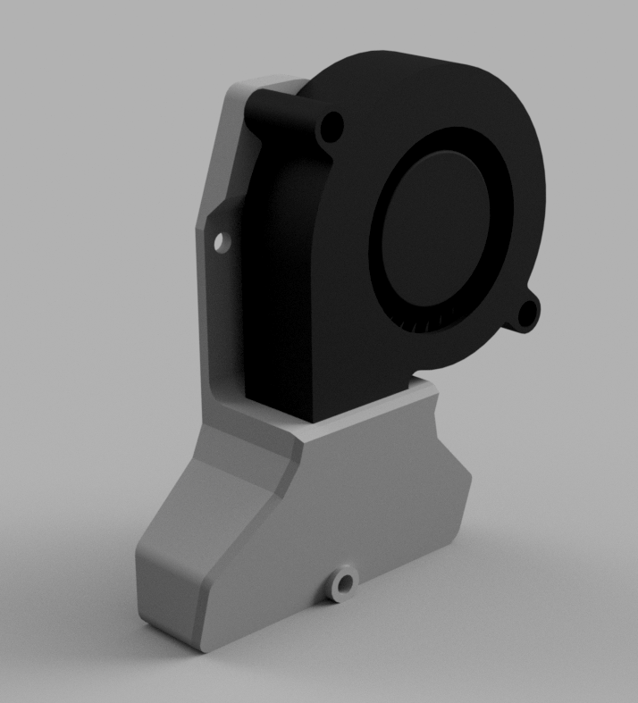
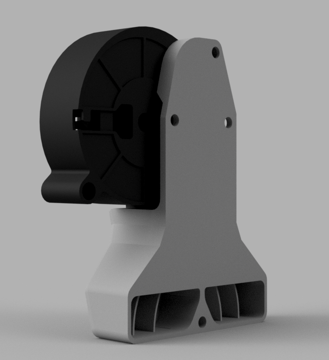

> Created by: [Jonathan Harper](https://www.github.com/jon-harper)

This intake mounts a 5015 blower fan aligned with the X axis, perpendicular to the default rear-facing for EVA 3. This orientation saves quite a bit of room on printers with limited rear Y-axis clearance, like the SainSmart Coreception.

## BOM

| No | Qty | Name                                           | Printable |
| -- | --- | ---------------------------------------------- | --------- |
| 1  | 2   | M3 x 6mm                                       | No        |
| 2  | 2   | M3 x 20mm                                      | No        |
| 3  | 1   | Heat inserts brass M3 x D4.6 x L4              | No        | 
| 4  | 1   | 5015 Blower Fan                                | No        | 
| 5  | 1   | rotated_5015_part_fan.stl                      | [Yes](stl/rotated_5015_part_fan-v3.0-inserts.stl)       |

## Brass Inserts

Inserts matching the EVA 3 spec are available at [AliExpress](https://aliexpress.com/item/4000232858343.html).

## Renders

