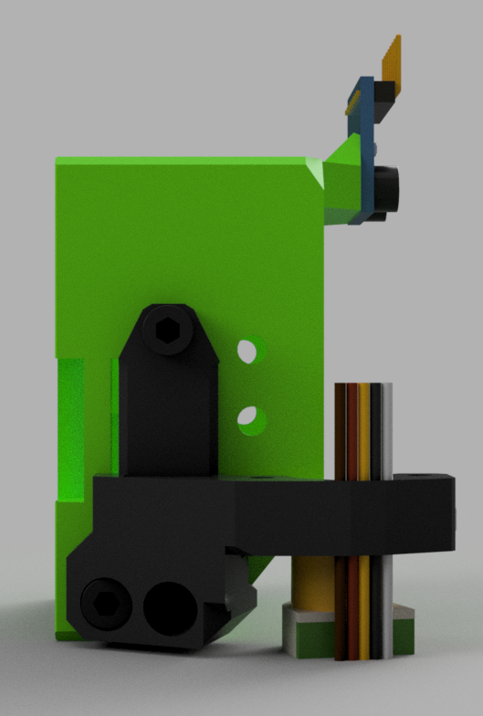

## Description

> Created by: [Jonathan Harper](https://www.github.com/jon-harper)

This is a simple EVA 3 mod that adds 6mm of belt grabber vertically on both sides of the front face. No new parts are needed for this mod, but BLTouch users will need to print the modified BLTouch mount.

## BOM

| No | Qty | Name                                            | Printable | 
|----|-----|-------------------------------------------------|-----------|
| 1  | 1   | front_universal-coreception-3.0-inserts.stl      | [Yes](stl/front_universal-coreception-3.0-inserts.stl)   |
| 2  | 2   | face_belt_grabber-coreception-3.0-inserts.stl    | [Yes](stl/face_belt_grabber-coreception-3.0-inserts.stl) |
| 3  | 2   | bl_touch_mount-coreception-3.0-inserts.stl      | [Yes](stl/bl_touch_mount-coreception-3.0-inserts.stl) |

## Brass Inserts

Inserts matching the EVA 3 spec are available at [AliExpress](https://aliexpress.com/item/4000232858343.html).

## Renders

## STEP Files

- Front Belt Grabber: [face_belt_grabber-coreception-3.0-inserts](assets/face_belt_grabber-coreception-3.0-inserts.step)
- Universal Front: [front_universal-coreception-3.0-inserts](assets/front_universal-coreception-3.0-inserts.step)