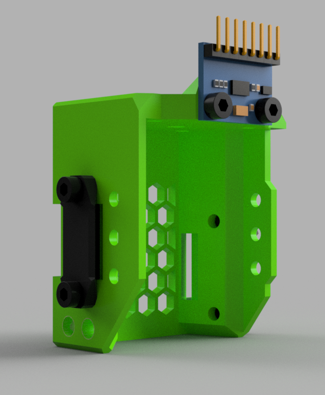

## Description

> Created by: [Jonathan Harper](https://www.github.com/jon-harper)

This is two mods in one: the universal front face can be useful to a wider range of printers, both cartesian and CoreXY. The back mod is meant specifically for the SainSmart Coreception. Both mods are to meant to assist with belt alignment.

## Universal Front Face

This is a simple EVA 3 mod that adds 6mm of belt grabber vertically on both sides of the front face. No new parts are needed for this mod, but BLTouch users will need to print the modified BLTouch mount.

## Coreception-compatible Back CoreXY Grabbers/Tensioners

This mod is more specific to the Coreception. The belts are closely aligned on the Coreception (4mm closer than on EVA). Here I have opted to rely on external tensioners; the back belt grabbers fasten to one another.

Additionally, the back belt grabbers now use 40mm M3 screws instead of M5, and matching heat set inserts are used instead of M5 lock nuts.

## BOM

| No | Qty | Name                                            | Printable | 
|----|-----|-------------------------------------------------|-----------|
| 1  | 2   | DIN 912 M3 40mm machine screws                  | No        |
| 2  | 2   | Heat inserts, brass, M3 x D4.6 x L4             | No        |
| 3  | 1   | front_universal-coreception-3.0-inserts.stl      | [Yes](stl/front_universal-coreception-3.0-inserts.stl)   |
| 4  | 2   | face_belt_grabber-coreception-3.0-inserts.stl    | [Yes](stl/face_belt_grabber-coreception-3.0-inserts.stl) |
| 5  | 1   | back_core_xy_fi-coreception-3.0-inserts.stl     | [Yes](stl/back_core_xy_fi-coreception-3.0-inserts.stl)  |
| 6  | 2   | core_xy_belt_grabber-coreception-3.0-inserts.stl| [Yes](stl/core_xy_belt_grabber-coreception-3.0-inserts.stl) |
| 7  | 2   | bl_touch_mount-coreception-3.0-inserts.stl      | [Yes](stl/bl_touch_mount-coreception-3.0-inserts.stl) |

## Brass Inserts

Inserts matching the EVA 3 spec are available at [AliExpress](https://aliexpress.com/item/4000232858343.html).

## Renders

## STEP Files

- CoreXY Back: [back_core_xy_fi-coreception-3.0-inserts](assets/back_core_xy_fi-coreception-3.0-inserts.step)
- CoreXY Belt Grabber: [core_xy_belt_grabber-coreception-3.0-inserts](assets/core_xy_belt_grabber-coreception-3.0-inserts.step)
- Front Belt Grabber: [face_belt_grabber-coreception-3.0-inserts](assets/face_belt_grabber-coreception-3.0-inserts.step)
- Universal Front: [front_universal-coreception-3.0-inserts](assets/front_universal-coreception-3.0-inserts.step)